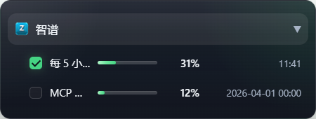
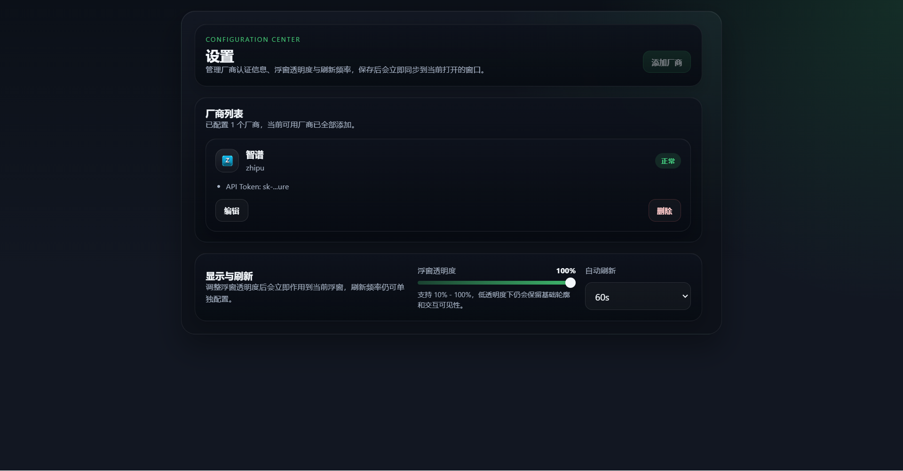

# Coding Plan Usage Tracker

[简体中文](./README.zh-CN.md) | [English](./README.en.md)

Coding Plan Usage Tracker is a Windows desktop floating widget for monitoring AI coding plan quota usage without constantly switching between browser tabs and provider dashboards.

## Release Info

- Current version: `v0.2.0`
- Target platform: Windows
- Stack: Electron 34, React 19, TypeScript, Vite 6
- Latest release: [GitHub Releases](https://github.com/JJChou000/coding-plan-usage-tracker/releases)
- Changelog: [docs/Changelog.md](./docs/Changelog.md)

## Screenshots

### Collapsed View


### Expanded View



### Docked View


### Settings Panel



## Highlights

- Always-on desktop floating window with collapsed, expanded, and edge-docked states
- System tray menu for refresh, settings, and quit
- Provider-specific quota display with configurable primary metric in collapsed mode
- Auto refresh with retry backoff, defaulting to `60s`
- Opacity control plus readability improvements for low-opacity scenarios
- Persistent local configuration via `electron-store`

## Provider Status

### Zhipu

- Auth field: `API Token`
- Data source: real online quota APIs
- Currently displayed metrics:
  - `5-hour Token usage`
  - `Monthly MCP quota`

### Alibaba Cloud Bailian

- Auth field: `Cookie`
- Current status: new setup is not publicly enabled yet
- Data source: mock data is still used until the real API is confirmed

## Installation

### Option 1: Download a release build

Download the latest Windows installer from [GitHub Releases](https://github.com/JJChou000/coding-plan-usage-tracker/releases).

### Option 2: Build locally

```bash
npm install
npm run build
```

The installer will be generated in `dist/`.

## Development

```bash
npm run dev
npm run test
npm run typecheck
npm run build
```

## Usage

1. Launch the app to show the floating window and tray icon.
2. Open the settings panel from the tray menu on first use.
3. Add a provider and fill in the required credentials.
4. Click the floating window to switch between collapsed and expanded views.
5. Choose which metric should stay visible in collapsed mode.
6. Drag the window to a screen edge to dock it, then click the edge handle to restore it.

## Repository Notes

- The root `README.md` acts as the repository landing page.
- Screenshot assets are stored under `docs/assets/readme/`.
- Local build artifacts such as `dist/`, `out/`, and `node_modules/` are kept out of GitHub.

## Additional Docs

- Product requirements: [docs/PRD.md](./docs/PRD.md)
- Engineering design: [docs/Engineering.md](./docs/Engineering.md)
- Development tasks: [docs/Development_Tasks.md](./docs/Development_Tasks.md)
- Changelog: [docs/Changelog.md](./docs/Changelog.md)
