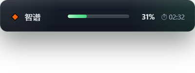
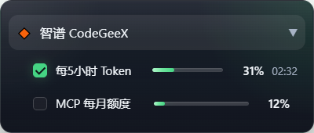
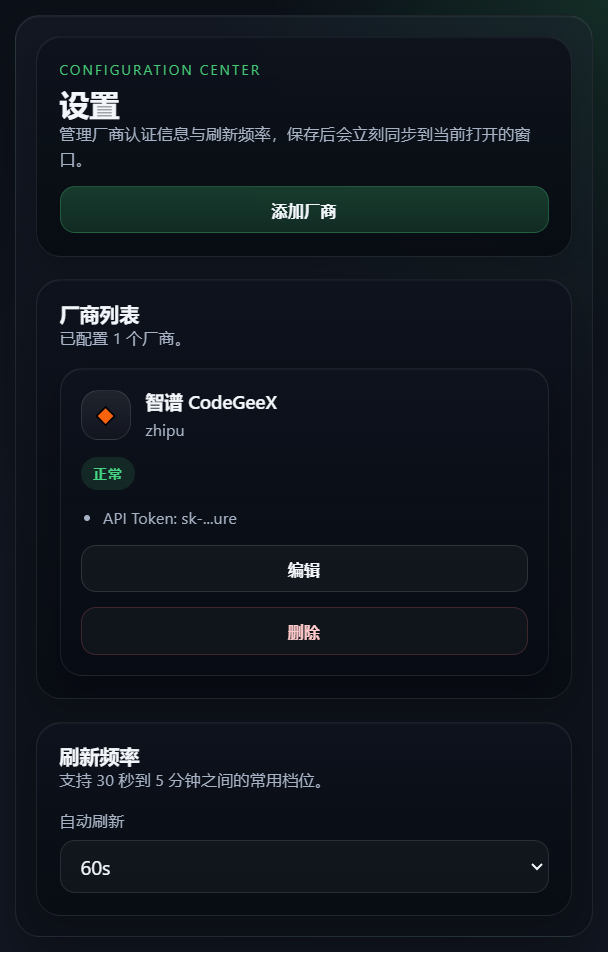

# Coding Plan Usage Tracker

Windows 桌面浮窗工具，用于集中监控多个 AI Coding Plan 的额度使用情况，减少在多个网页之间来回切换的成本。

## 项目状态

- 当前版本：`v0.1.1`
- 目标平台：Windows
- 技术栈：Electron 34、React 19、TypeScript、Vite 6
- 当前已完成：浮窗主界面、系统托盘、设置面板、智谱真实额度接入、阿里云百炼展示链路、自动刷新、边缘吸附、Windows 安装包构建

## 功能特性

- 桌面常驻浮窗，支持折叠态和展开态查看额度
- 系统托盘菜单，支持刷新、打开设置、退出应用
- 支持拖拽、置顶、边缘吸附和点击把手恢复
- 支持多维度额度展示和折叠态主指标勾选
- 支持刷新频率配置，默认 `60s`，可选 `30s / 60s / 120s / 300s`
- 使用 `electron-store` 持久化窗口位置、刷新频率和厂商配置
- 智谱 CodeGeeX 已接入真实额度查询链路
- 阿里云百炼已完成 UI 与 Provider 接口接入，当前仍使用 mock 数据展示

## 界面截图

### 折叠态



### 展开态



### 设置面板



## 安装方式

### 方式一：下载 Release 安装包

从 GitHub Releases 下载 Windows 安装包并安装。安装完成后，应用会出现在桌面和开始菜单中。

### 方式二：本地构建

```bash
npm install
npm run build
```

构建完成后，安装包会输出到 `dist/` 目录，文件名类似：

```text
Coding Plan Usage Tracker Setup 0.1.1.exe
```

## 使用说明

1. 启动应用后，桌面会出现浮窗，系统托盘会出现应用图标。
2. 首次使用时，右键托盘图标，点击“设置”打开设置面板。
3. 添加厂商并填写认证信息后，浮窗会自动开始刷新额度数据。
4. 点击浮窗可在折叠态和展开态之间切换。
5. 展开态中可以勾选需要在折叠态显示的主维度。
6. 将浮窗拖拽到屏幕边缘后会自动吸附，点击边缘把手可恢复显示。

## 厂商配置指南

### 智谱 CodeGeeX

- 配置字段：`API Token`
- 数据来源：真实线上额度接口
- 支持展示 `每 5 小时 Token` 与 `MCP 每月额度`

### 阿里云百炼

- 配置字段：`Cookie`
- 当前状态：已接入设置、UI 和 Provider 结构，当前展示的是 mock 数据
- 当前发布策略：默认不在“添加厂商”列表中开放，保留代码与配置兼容性，待真实 API 准备完成后再恢复入口
- 计划支持 `近 5 小时用量`、`近一周用量`、`近一月用量`

## 开发命令

```bash
npm run dev
npm run build
npm run build:unpack
```

## 已知说明

- 智谱链路已完成真实数据接入。
- 阿里云百炼真实 API 仍待进一步抓包确认，当前版本对外应明确说明其为 mock 展示。
- 透明浮窗环境下，部分真实鼠标点击场景在自动化里不稳定，因此发布前仍建议人工复核展开态 checkbox 和边缘把手点击恢复。
