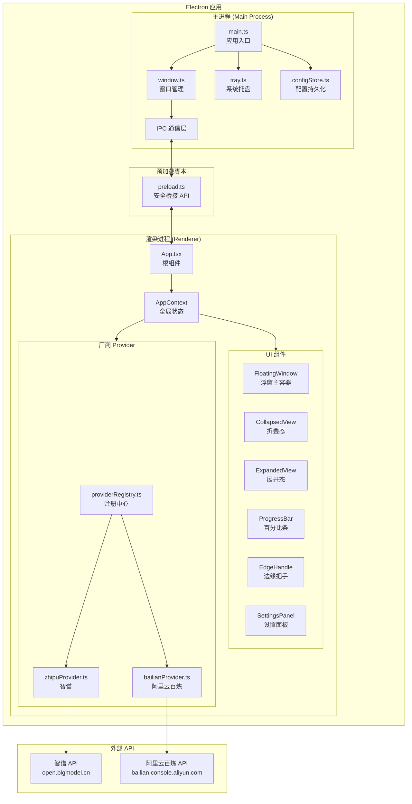

# 工程设计文档 (Engineering)

## 1. 技术架构总览



---

## 2. 技术栈选型

| 层级 | 技术 | 版本 | 选型理由 |
|---|---|---|---|
| **桌面框架** | Electron | 34+ | 成熟稳定；浮窗/托盘/透明窗口支持完善；JS 生态复用参考代码 |
| **前端框架** | React | 19 | 最主流前端框架；组件化开发；社区资源最丰富 |
| **构建工具** | Vite | 6 | 极速 HMR；Electron + React 的成熟整合方案 |
| **语言** | TypeScript | 5.7+ | 类型安全；减少运行时错误 |
| **样式** | Vanilla CSS | - | 无额外依赖；完全控制毛玻璃效果所需的 `backdrop-filter` 等属性 |
| **状态管理** | React Context + useReducer | - | 状态简单，无需 Redux 等重量级方案 |
| **配置存储** | electron-store | 10+ | 简单键值存储；支持加密；无需数据库 |
| **打包** | electron-builder | 25+ | 打包 Windows 安装包 (NSIS/MSI) |
| **脚手架** | electron-vite | 3+ | Electron + Vite 官方推荐整合方案，提供开箱即用的 main/renderer/preload 配置 |

---

## 3. 数据模型

> 本项目不使用数据库，仅通过 `electron-store` 持久化用户配置。以下为核心数据类型定义。

### 3.1 TypeScript 类型定义 (`src/shared/types.ts`)

```typescript
// ===== 厂商配置 =====
/** 单个配额维度（百分比条） */
interface QuotaDimension {
  id: string;              // 唯一标识，如 'token_5h', 'mcp_monthly'
  label: string;           // 显示名称，如 '每5小时 Token', 'MCP 每月额度'
  usedPercent: number;     // 使用百分比 0-100
  used: number;            // 已用量（原始值）
  total: number;           // 总量（原始值）
  resetTime?: string;      // 重置时间（ISO 格式或可读文本）
  isChecked: boolean;      // 是否在折叠态显示
}

/** 厂商用量数据 */
interface ProviderUsageData {
  providerId: string;
  dimensions: QuotaDimension[];
  lastUpdated: number;     // 时间戳
  error?: string;          // 错误信息
}

/** 厂商认证字段定义 */
interface AuthField {
  key: string;             // 字段名
  label: string;           // 显示标签
  type: 'text' | 'password'; // 输入类型
  placeholder?: string;
  required: boolean;
}

/** 厂商 Provider 接口 */
interface IProvider {
  id: string;              // 唯一ID，如 'zhipu', 'bailian'
  name: string;            // 显示名称
  icon: string;            // 图标路径或 base64
  getAuthFields(): AuthField[];
  fetchUsage(authConfig: Record<string, string>): Promise<ProviderUsageData>;
}

// ===== 应用配置（electron-store 持久化） =====
interface ProviderConfig {
  providerId: string;
  auth: Record<string, string>;  // 认证信息 {token: 'sk-xxx'}
  checkedDimensions: string[];   // 折叠态展示的维度 ID 列表
  enabled: boolean;
}

interface AppConfig {
  providers: ProviderConfig[];
  refreshInterval: number;       // 刷新间隔（秒），默认 60
  windowPosition: { x: number; y: number };
  windowState: 'normal' | 'docked-left' | 'docked-right' | 'docked-top' | 'docked-bottom';
  isExpanded: boolean;
}

// ===== 全局状态 =====
interface AppState {
  config: AppConfig;
  usageData: Map<string, ProviderUsageData>;
  isLoading: boolean;
  settingsOpen: boolean;
}
```

> 兼容性说明：`windowState` 仍保留历史吸附枚举值以兼容旧配置，但运行时仅允许 `normal` 与 `docked-right` 生效；读取到 `docked-left` / `docked-top` / `docked-bottom` 时会自动回退到 `normal`。

### 3.2 配置存储结构 (electron-store)

```json
{
  "providers": [
    {
      "providerId": "zhipu",
      "auth": { "authToken": "sk-xxx..." },
      "checkedDimensions": ["token_5h"],
      "enabled": true
    },
    {
      "providerId": "bailian",
      "auth": { "cookie": "..." },
      "checkedDimensions": ["usage_5h"],
      "enabled": true
    }
  ],
  "refreshInterval": 60,
  "windowPosition": { "x": 100, "y": 100 },
  "windowState": "normal",
  "isExpanded": false
}
```

---

## 4. IPC 通信设计

主进程和渲染进程通过 Electron IPC 通信，preload 脚本暴露安全 API。

### 4.1 通信通道

| 通道 | 方向 | 用途 |
|---|---|---|
| `config:get` | Renderer → Main → Renderer | 获取应用配置 |
| `config:set` | Renderer → Main | 保存应用配置 |
| `usage:fetch` | Renderer → Main → Renderer | 请求获取厂商用量数据 |
| `usage:data` | Main → Renderer | 推送最新用量数据 |
| `window:set-position` | Renderer → Main | 更新窗口位置 |
| `window:set-state` | Renderer → Main | 更新窗口状态（正常/仅右侧吸附） |
| `window:toggle-expand` | Renderer → Main | 切换折叠/展开（需调整窗口尺寸） |
| `app:refresh` | Main → Renderer | 托盘菜单触发刷新 |
| `app:open-settings` | Main → Renderer | 托盘菜单打开设置 |

### 4.2 Preload API 暴露

```typescript
// preload.ts 暴露给渲染进程的 API
contextBridge.exposeInMainWorld('electronAPI', {
  // 配置
  getConfig: () => ipcRenderer.invoke('config:get'),
  setConfig: (config: AppConfig) => ipcRenderer.invoke('config:set', config),
  // 用量数据
  fetchUsage: (providerId: string) => ipcRenderer.invoke('usage:fetch', providerId),
  onUsageData: (callback: (data: ProviderUsageData) => void) =>
    ipcRenderer.on('usage:data', (_, data) => callback(data)),
  // 窗口控制
  setWindowPosition: (pos: {x: number, y: number}) =>
    ipcRenderer.send('window:set-position', pos),
  setWindowState: (state: string) =>
    ipcRenderer.send('window:set-state', state),
  resizeWindow: (width: number, height: number) =>
    ipcRenderer.send('window:resize', width, height),
  // 事件监听
  onRefresh: (callback: () => void) =>
    ipcRenderer.on('app:refresh', callback),
  onOpenSettings: (callback: () => void) =>
    ipcRenderer.on('app:open-settings', callback),
});
```

---

## 5. 项目目录结构

```
coding-plan-usage-tracker/
├── .agent/
│   └── rules.md                    # 项目规则
├── docs/
│   ├── PRD.md                      # 产品需求文档
│   ├── Engineering.md              # 工程设计文档
│   ├── Development_Tasks.md        # 开发任务清单
│   ├── User_Tasks.md               # 用户操作手册
│   └── Changelog.md                # 变更日志
├── src/
│   ├── main/                       # Electron 主进程
│   │   ├── main.ts                 # 应用入口，创建窗口、注册IPC
│   │   ├── window.ts               # 窗口管理（创建、拖拽、边缘吸附）
│   │   ├── tray.ts                 # 系统托盘
│   │   └── configStore.ts          # electron-store 封装
│   ├── preload/
│   │   └── preload.ts              # contextBridge 安全暴露 API
│   ├── renderer/                   # React 渲染进程
│   │   ├── main.tsx                # React 入口
│   │   ├── App.tsx                 # 根组件
│   │   ├── components/
│   │   │   ├── FloatingWindow.tsx  # 浮窗主容器
│   │   │   ├── FloatingWindow.css
│   │   │   ├── CollapsedView.tsx   # 折叠态视图
│   │   │   ├── CollapsedView.css
│   │   │   ├── ExpandedView.tsx    # 展开态视图
│   │   │   ├── ExpandedView.css
│   │   │   ├── ProgressBar.tsx     # 百分比进度条
│   │   │   ├── ProgressBar.css
│   │   │   ├── EdgeHandle.tsx      # 边缘吸附把手
│   │   │   ├── EdgeHandle.css
│   │   │   ├── SettingsPanel.tsx   # 设置面板
│   │   │   └── SettingsPanel.css
│   │   ├── providers/
│   │   │   ├── providerRegistry.ts # 厂商注册中心
│   │   │   ├── zhipuProvider.ts    # 智谱 Provider
│   │   │   └── bailianProvider.ts  # 阿里云百炼 Provider
│   │   ├── context/
│   │   │   └── AppContext.tsx       # 全局状态 Context
│   │   ├── hooks/
│   │   │   ├── useAutoRefresh.ts   # 自动刷新 Hook
│   │   │   └── useWindowDrag.ts    # 窗口拖拽 Hook
│   │   └── styles/
│   │       ├── variables.css       # CSS 变量（颜色、尺寸）
│   │       └── global.css          # 全局样式、毛玻璃基础
│   └── shared/
│       └── types.ts                # 共享类型定义
├── resources/
│   └── icons/                      # 应用图标、厂商图标
│       ├── app-icon.png
│       ├── tray-icon.png
│       ├── zhipu.png
│       └── bailian.png
├── electron.vite.config.ts         # electron-vite 配置
├── electron-builder.yml            # 打包配置
├── package.json
├── tsconfig.json
├── tsconfig.node.json
├── tsconfig.web.json
└── README.md
```

---

## 6. 关键工程决策

### 6.1 API 请求在主进程执行

- **原因**：Electron 渲染进程受 CORS 限制，无法直接请求第三方 API
- **方案**：渲染进程通过 IPC 发送请求到主进程 → 主进程使用 `net.fetch` 或 Node.js `https` 模块请求 → 返回数据给渲染进程
- **好处**：绕过 CORS；Token 不暴露在渲染进程中

### 6.2 毛玻璃效果实现

- **Windows**：Electron 不原生支持亚克力效果，通过以下方式实现：
  - 窗口设置 `transparent: true`, `frame: false`
  - CSS 使用 `backdrop-filter: blur()` + 半透明背景色
  - 若需更原生效果，可使用 `@aspect-apps/electron-vibrancy` 等第三方库（作为增强项）

### 6.3 边缘吸附算法（当前仅右侧）

```
1. 监听窗口拖拽结束事件
2. 获取窗口最终位置 (x, y) 和屏幕尺寸
3. 判断右边缘阈值（距右边缘 < 20px）：
   - 右边缘: x + 窗口宽度 > 屏幕宽度 - 20 → 状态设为 'docked-right'，窗口 x 设为 `屏幕宽度 - 把手宽度`
   - 其余边缘：不触发吸附，保持 `normal`
4. 吸附后显示 EdgeHandle 组件
5. 点击 EdgeHandle → 恢复正常位置
6. 若读到历史配置中的 `docked-left` / `docked-top` / `docked-bottom`，启动和托盘恢复时自动回退到 `normal`
```

### 6.4 刷新策略

```
- 启动后立即请求一次
- 之后每 N 秒（可配置，默认 60）自动刷新
- 请求失败时：
  - 第 1 次失败：30 秒后重试
  - 第 2 次失败：60 秒后重试
  - 第 3+ 次失败：300 秒后重试
  - 显示错误状态但保留最后成功数据
- 手动刷新：忽略退避，立即请求
```

### 6.5 智谱 API 详细参考

基于 `glm-usage-vscode` 仓库源码整理的 API 信息：

| 项目 | 值 |
|---|---|
| **基础 URL** | `https://open.bigmodel.cn/api/anthropic` |
| **认证方式** | 请求头 `Authorization: <token>` |
| **配额接口** | `GET {domain}/api/monitor/usage/quota/limit` |
| **用量接口** | `GET {domain}/api/monitor/usage/model-usage?startTime=...&endTime=...` |
| **工具接口** | `GET {domain}/api/monitor/usage/tool-usage?startTime=...&endTime=...` |
| **配额数据解析** | `response.data.limits[]` 中 `type='TIME_LIMIT'` 为 MCP，`type='TOKENS_LIMIT'` 为 5h Token |
| **百分比计算** | `(currentValue / usage) * 100` |
| **时间格式** | `YYYY-MM-DD HH:mm:ss` |

### 6.6 阿里云百炼 API（待确认）

> ⚠️ 目前未找到公开 API。需要在开发阶段通过以下方式确认：
> 1. 用户打开百炼控制台，**先打开 DevTools Network 标签页**，然后**刷新页面**
> 2. 查看 "All" 而非 "Fetch/XHR" 过滤器（数据可能通过其他方式加载）
> 3. 搜索包含用量数据的响应，确定真实 API 端点和认证方式
> 
> **备选方案**：如果无法找到可用 API，考虑使用 Electron 的 `BrowserWindow` 在后台加载控制台页面并通过 `webContents.executeJavaScript` 提取数据。
