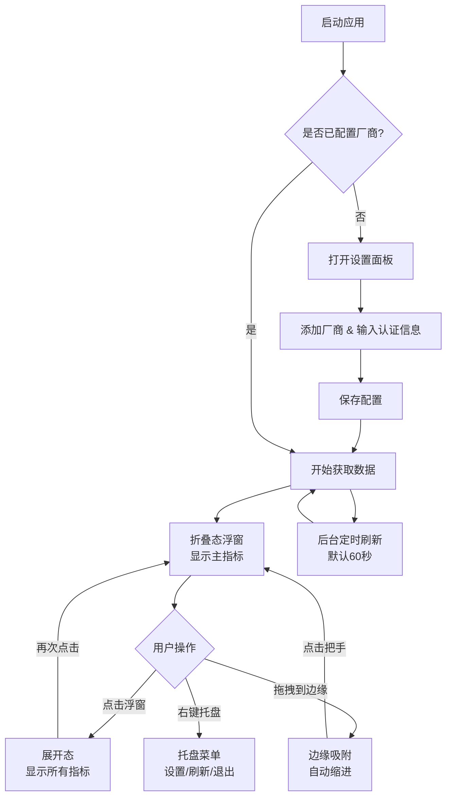
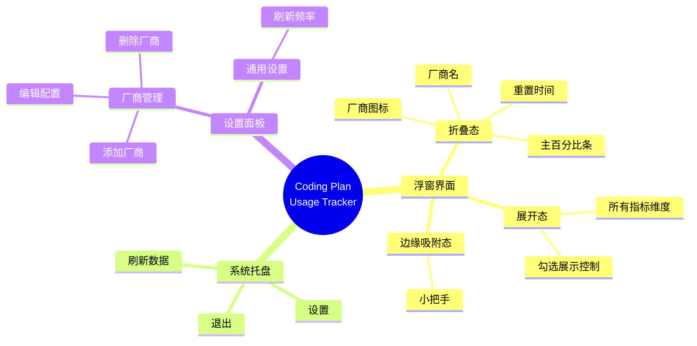

# 产品需求文档 (PRD)

## 1. 产品概述

### 1.1 产品定位

**Coding Plan Usage Tracker** 是一款 Windows 桌面浮窗工具，帮助 AI 编程用户集中监控多个 Coding Plan 的额度使用情况，告别在多个网页间反复查看的低效操作。

### 1.2 目标用户

使用 AI 辅助编程工具并订阅了 Coding Plan 的开发者，特别是同时使用多个厂商服务的用户。

### 1.3 核心价值

| 价值维度 | 描述 |
|---|---|
| **集中管理** | 一个浮窗查看所有厂商的额度状态 |
| **实时监控** | 自动定时刷新，无需手动打开网页 |
| **预警提醒** | 额度即将用尽时视觉提醒 |
| **不打扰** | 桌面浮窗常驻，折叠态极简，不影响工作 |

---

## 2. 核心使用流程



---

## 3. MVP 功能详细设计

### 3.1 模块总览

| 模块 | 功能 | 优先级 |
|---|---|---|
| **浮窗主界面** | 折叠/展开显示额度信息 | P0 |
| **系统托盘** | 托盘图标 + 右键菜单 | P0 |
| **厂商: 智谱 (GLM)** | 获取并展示 MCP 额度 + 5h Token 限流 | P0 |
| **厂商: 阿里云百炼** | 获取并展示 5h/7d/30d 用量 | P0 |
| **设置面板** | 添加/编辑/删除厂商配置 | P0 |
| **窗口行为** | 置顶、拖拽、边缘吸附 | P0 |
| **视觉风格** | 毛玻璃效果、深色主题 | P1 |

### 3.2 浮窗主界面

#### 3.2.1 折叠态

每个已配置的厂商占一行，显示：

```
[厂商图标] [厂商名] ████████░░ 31% | 重置: 12:00
```

- 图标：厂商 Logo（16x16）
- 厂商名：如 "智谱" / "百炼"
- 百分比条：彩色进度条，颜色随百分比变化（绿 → 黄 → 红）
- 百分比数字：当前使用率
- 重置时间：下次额度重置时间（如有）
- **智谱**：默认展示「每5小时使用额度」的百分比
- **阿里云**：默认展示「近5小时用量」的百分比

#### 3.2.2 展开态

点击浮窗后展开，显示该厂商所有额度维度：

**智谱 (GLM) 展开后：**
```
☑ 每5小时 Token  ████████░░ 31%  重置: 12:00
☑ MCP 每月额度   ░░░░░░░░░░  0%  重置: 03-27
```

**阿里云百炼展开后：**
```
☑ 近5小时用量    ██░░░░░░░░  6%  重置: 10:32:42
☐ 近一周用量     ████░░░░░░ 25%  重置: 03-23
☐ 近一月用量     ███░░░░░░░ 18%  重置: 04-13
```

- 复选框 (☑/☐)：控制该维度是否在折叠态显示
- 默认勾选第一个维度
- 勾选状态持久化保存

### 3.3 窗口行为

| 行为 | 描述 |
|---|---|
| **置顶** | 浮窗始终在其他窗口之上 |
| **可拖拽** | 鼠标按住浮窗可自由拖拽移动 |
| **边缘吸附** | 拖拽到屏幕边缘时，浮窗自动缩进边缘，仅露出一个小把手（约 20px 宽的半透明条带） |
| **从边缘弹出** | 点击把手，浮窗从边缘弹出恢复显示 |
| **折叠/展开** | 点击浮窗主体区域切换折叠/展开状态 |
| **记忆位置** | 记住浮窗在屏幕上的位置，重启后恢复 |

### 3.4 系统托盘

右键菜单项：
1. **刷新数据** — 立即刷新所有厂商数据
2. **设置** — 打开设置面板
3. **分隔线**
4. **退出** — 关闭应用

### 3.5 设置面板

独立窗口（非浮窗），包含：
- **厂商列表**：已添加的厂商及其状态（正常/错误/未配置）
- **添加厂商**：从支持的厂商列表中选择并配置认证信息
- **编辑厂商**：修改 Token/认证信息
- **删除厂商**：移除已添加的厂商
- **通用设置**：刷新频率（30s/60s/120s/300s 可选）

---

## 4. 页面元素与布局结构

### 4.1 浮窗（折叠态）

```
┌─────────────────────────────────────┐  ← 毛玻璃背景
│ 🔸 智谱  ████████░░ 31% | ⏱ 12:00  │  ← 行高 ~32px
│ 🔹 百炼  ██░░░░░░░░  6% | ⏱ 10:32  │
└─────────────────────────────────────┘
  浮窗宽度: ~320px, 高度: 行数 × 32px + padding
```

### 4.2 浮窗（展开态）

```
┌─────────────────────────────────────┐
│ 🔸 智谱                         ▼  │  ← 厂商标题行
│  ☑ 5h Token  ████████░░ 31% 12:00  │  ← 子指标行
│  ☑ MCP额度   ░░░░░░░░░░  0% 03-27  │
│─────────────────────────────────────│  ← 分隔线
│ 🔹 阿里云百炼                   ▼  │
│  ☑ 近5小时   ██░░░░░░░░  6% 10:32  │
│  ☐ 近一周    ████░░░░░░ 25% 03-23  │
│  ☐ 近一月    ███░░░░░░░ 18% 04-13  │
└─────────────────────────────────────┘
```

### 4.3 边缘吸附态

```
屏幕右边缘:
             ┌──┐
             │▶ │  ← 小把手，点击弹出浮窗
             │  │
             └──┘
```

### 4.4 信息架构图



---

## 5. 后续迭代规划

### 5.1 版本规划

| 版本 | 功能 | 时间 |
|---|---|---|
| **v0.1.0** | MVP：智谱 + 阿里云，浮窗基础功能 | 第 1-2 周 |
| **v0.2.0** | 新增 MiniMax、火山引擎厂商支持 | 第 3 周 |
| **v0.3.0** | 新增腾讯云、Kimi 厂商支持 | 第 4 周 |
| **v1.0.0** | 稳定版发布，完善文档，GitHub Release | 第 5 周 |

### 5.2 非功能性需求

| 需求 | 标准 |
|---|---|
| **启动速度** | 应用启动到首次显示数据 < 3 秒 |
| **内存占用** | 常驻内存 < 150MB |
| **网络异常** | 请求失败时优雅降级，显示上次成功数据 + 错误标识 |
| **Token 安全** | Token 使用 electron-store 加密存储，不明文写入配置文件 |
| **更新机制** | 后续可考虑 GitHub Release + 自动更新 |
